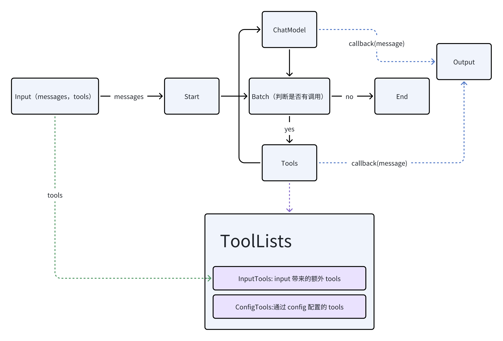

# React

## 介绍

React 是 agent 架构的一种，甚至可以认为是一个原子级角色，它采取的是***推理->执行->反思***的逻辑闭环架构，但是 Eino 提供的原生 react 具有一定的缺陷，需要小小魔改一下。

## 优化点

1. batch 节点完全阻塞 chatModel 输出流，判断是否有 function call ，解决原 react 只判断第一个 message 片段有无 function call 的尴尬短板。
2. 采用 callback 机制实时读取 react 的输出，而无需等待流到 end 节点，同时规避了上一点的完全阻塞问题。
3. 额外添加了一个外界可控的ToolList：每次执行图前可通过**WithTools**函数进行额外的tool增加，并且这些额外的tool不会直接暴露给chatModel，只有当ConfigTools中有tool指引chatModel去使用**special_get_tool**获取tool才会获得额外的tool，目前是作为渐进式skill的基石所设（假设skill是configTools，skill需要调用tool1、tool2，这个时候就可以暴露tool了）。

## 架构图

