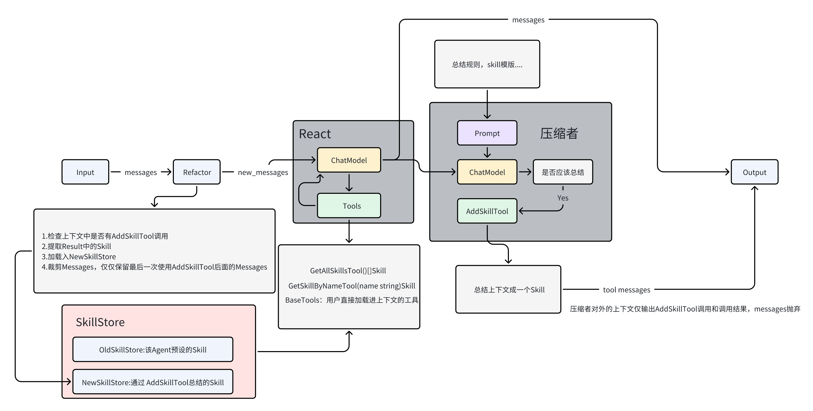

<h1>Compress Agent</h1>

一个通过压缩上下文实现承载超长上下文的Agent

## 优点

可把原上下文原封不动地传入agent，并且是无状态的，不需要任何状态持久化。

## 缺点

一次运行是普通react的n+1轮对话，消耗token可能比较多

最终压缩的质量受压缩者的影响。

## 架构图

## 详情

### 核心概念

***断言：一段可压缩的上下文，必定是user开头，add skill 输出为结尾。***

也就是说在react前增加一个过滤器，将原上下文通过 add skill 输出为结尾的一段上下文视为【子上下文】，将 add skill 的输出添加进skill list中，可套娃，【子上下文】的【子上下文】被视为skill

### 如何触发压缩？

在react终点添加一个压缩react，他只做一件事，压缩上下文，只会调用压缩工具总结，至于其它输出，一概放弃，不要污染上下文。

在react 起点增加一个过滤器，根据上文提到的分块方式去重构上下文，将重构后的上下文交给react。

### 关于skill炼狱

随着上下文不断变长，即使转换成了skill，但也导致了超多skill，一场关于skill的炼狱。

为 add skill 增添选项：将引用到的skill 隐藏起来。也就是只有当使用父skill时，子skill才会被加载，这也变得考验重构者的智力。

### skill name 重复

因为隐藏skill，重构者有可能会给出重复的name用于新的skill，可以在最后tool result 时重写name，重写规则可以自定义。